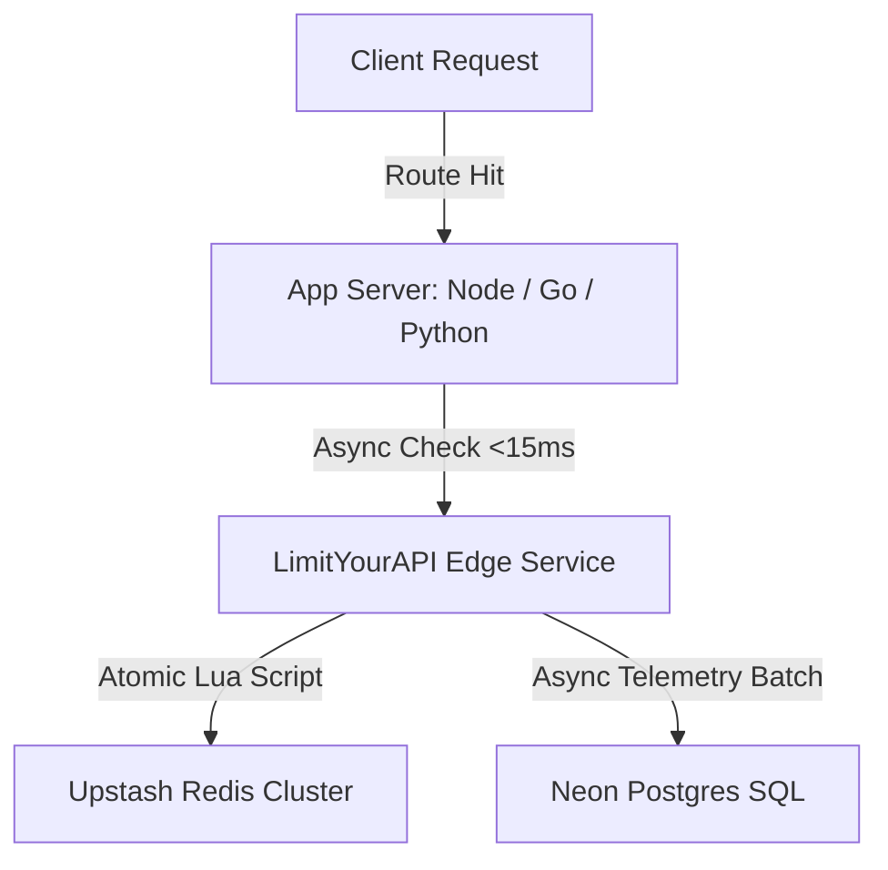

<div align="center">
  
  <h1>LimitYourAPI</h1>
  <p><strong>Production-grade distributed rate limiting infrastructure for developers.</strong></p>

  <p>
    <a href="https://github.com/trynayash/LimityourAPI-Repo/actions"></a>
    <a href="https://www.npmjs.com/package/limityourapi"></a>
    <a href="https://github.com/trynayash/LimityourAPI-Repo/blob/main/LICENSE"></a>
    <a href="https://golang.org"></a>
    <a href="https://react.dev"></a>
  </p>

  <h4>
    <a href="https://limityourapi.tech">Website</a>
    <span> · </span>
    <a href="https://limityourapi.tech/docs">Documentation</a>
    <span> · </span>
    <a href="https://limityourapi.tech/pricing">Pricing</a>
    <span> · </span>
    <a href="https://limityourapi.tech/blog">Blog</a>
  </h4>
</div>

---

## 💡 What is LimitYourAPI?

**LimitYourAPI** is a high-performance, developer-first API rate limiting platform. Engineered for sub-15ms latency, it provides centralized atomic rate-limiting, comprehensive threat intelligence, and global monetization pipes to transform any API into a resilient, scalable product.

### Why use LimitYourAPI instead of in-memory maps or API gateways?
1. **Consistency at Scale:** In-memory rate limiting fails when your application is scaled horizontally behind a load balancer. LimitYourAPI uses atomic Redis Lua scripts to maintain global consistency.
2. **Event Loop Resiliency:** Offloads CPU-intensive sliding-window computations from single-threaded runtimes (like Node.js), preventing event loop starvation.
3. **Fail-Open Design:** Out-of-the-box client SDK resilience. If the rate limiter database experiences latency, client requests fail-open, guaranteeing no disruption to your user experience.

---

## ⚡ Architecture Overview

LimitYourAPI decouples rate limit decisions from your core application logic to minimize database connection pool contention.



### Core Architecture Highlights
* **Atomic Redis Lua Scripts:** Prevents race conditions where two concurrent requests from the same user exceed their remaining quota.
* **Non-Blocking Telemetry:** Buffers telemetry logs in memory and flushes them to PostgreSQL in batches, saving database CPU cycles.
* **Fail-Safe Circuit Breaker:** Local SDK fallback rules maintain performance bounds if network connectivity is compromised.

---

## 🌟 Features

* **💰 Multi-Tier SaaS Quotas:** Enforce daily/monthly plan quotas per API key or user ID out of the box.
* **🛡️ Defensive Inspections:** Advanced bot protection, IP reputation verification, and request signatures.
* **📊 Time-Series Telemetry:** High-resolution request heatmaps, block rate trends, and latency percentiles.
* **🔐 Hardware-Grade Security:** JWT sessions and secure authenticator MFA (TOTP).

---

## 📦 SDK Integrations & Installation

### 1. JavaScript / TypeScript SDK

Install the official npm package:

```bash
npm install limityourapi
```

#### TypeScript / Type-Safe Config
```typescript
import { LimitYourAPIClient, LimitYourAPIOptions } from 'limityourapi';

const config: LimitYourAPIOptions = {
  baseUrl: 'https://api.v2.limityourapi.tech',
  apiKey: process.env.LIMIT_YOUR_API_KEY || '',
  timeout: 500, // 500ms socket timeout budget
  failOpen: true
};

const limiter = new LimitYourAPIClient(config);
const decision = await limiter.check({ endpoint: '/v1/items' });
```

#### Express Middleware (JavaScript)
```javascript
import { LimitYourAPIClient } from 'limityourapi';
const limiter = new LimitYourAPIClient({
  baseUrl: 'https://api.v2.limityourapi.tech',
  apiKey: process.env.LIMIT_YOUR_API_KEY
});

app.use('/api', async (req, res, next) => {
  const result = await limiter.check({ endpoint: req.path });
  res.setHeader('X-RateLimit-Limit', result.limit);
  res.setHeader('X-RateLimit-Remaining', result.remaining);
  res.setHeader('X-RateLimit-Reset', result.resetIn);
  
  if (!result.allowed) {
    res.setHeader('Retry-After', result.retryAfter);
    return res.status(429).json({ error: 'Too Many Requests' });
  }
  next();
});
```

### 2. Python SDK

```bash
pip install limityourapi
```

```python
from limityourapi import LimitYourAPI

limiter = LimitYourAPI(api_key="your_api_key", timeout=2.0)
decision = limiter.check(endpoint="/profile")
```

### 3. Go SDK

```bash
go get github.com/trynayash/limityourapi-go
```

```go
import "github.com/trynayash/limityourapi-go"

client := limityourapi.NewClient("your_api_key", true)
decision, err := client.Check(context.Background(), "/v1/items", nil, nil)
```

---

## 📊 Performance Benchmarks

In-memory locking vs. remote distributed database latency comparisons under high concurrent load:

| Metric | Local In-Memory | LimitYourAPI (Lua/Redis) |
| --- | --- | --- |
| **Decision Latency (p50)** | 0.1ms (Blocks Node loop) | **<15ms (Non-blocking async)** |
| **Distributed Consistency** | ❌ No | **✅ Yes** |
| **Data Persistence** | ❌ No | **✅ Yes** |
| **Multi-instance isolation** | ❌ No | **✅ Yes** |

---

## 🤝 Community & Support

* **[Contributing Guide](CONTRIBUTING.md)**: Find instructions on branching models, branch naming, and setting up local servers.
* **[Security Policy](SECURITY.md)**: Learn how to report vulnerabilities privately.
* **[Code of Conduct](CODE_OF_CONDUCT.md)**: Our expectations for community behavior.
* **[Changelog](CHANGELOG.md)**: Explore version updates.

---

## 📄 License
Released under the **Apache 2.0 License**. Developed with precision for scalable systems.
